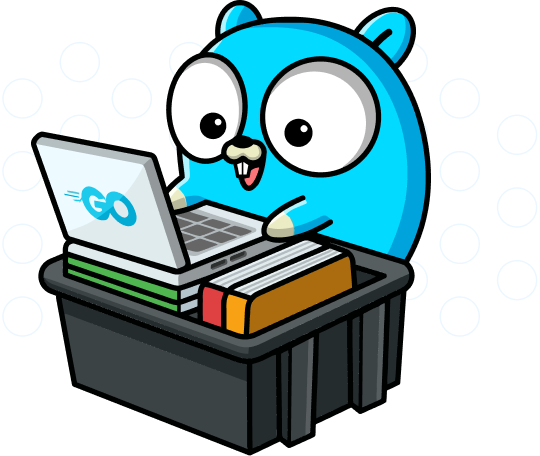

<div align="center" id="top"> 
  
  &#xa0;
</div>

<h1 align="center">Desafio-Golang</h1>

Este repositório contêm o código-fonte do desafio proposto.

## Docker

O primeiro módulo apresenta.

1. Uma simples aplicação Golang que mostra uma determinada mensagem quando rodada em um  container

### Aplicação Golang
Está aplicação deverá mostrar na tela a mensagem <small>"Full Cycle Rocks!!"</small> quando executada. A aplicação está disponível através de uma imagem Docker armazenada no Docker Hub. Para executá-la, basta rodar o comando a seguir:

```bash
    docker run hugocabral28/fullcycle
```

O código-fonte da aplicação está disponível em <small>[Fullcycle/golang](golang/app.go).</small>